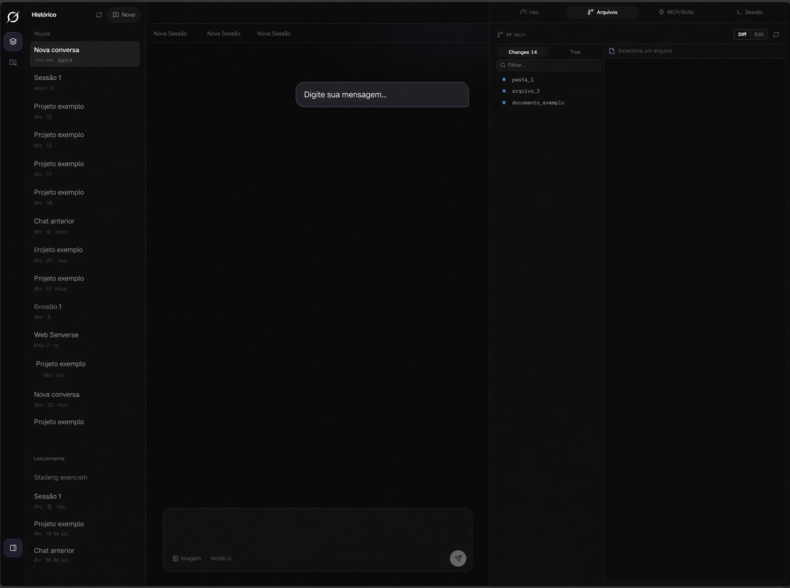

# Grok Web

Interface gráfica **local** para o [Grok Build](https://grok.com) (CLI/TUI).  
O agent continua rodando na sua máquina (`grok agent serve`); o browser vira a UI rica — chat, sessões, arquivos, MCP, skills e uso.

> **Não é o chat do grok.com.**  
> Tools, git, filesystem e MCP rodam no **agent local**, não no Next.js.



---

## Arquitetura

```
┌─────────────────────────────────────────────────────────────┐
│  Browser  http://127.0.0.1:3847                              │
│  chat · abas · /slash · fila · arquivos · MCP · skills · uso│
└───────────────────────────┬─────────────────────────────────┘
                            │ HTTP (APIs Next)
                            ▼
┌─────────────────────────────────────────────────────────────┐
│  Next.js (Node, bind 127.0.0.1)                               │
│  /api/sessions · /api/diffs · /api/fs · /api/mcp · /api/…   │
└───────────────────────────┬─────────────────────────────────┘
                            │ WebSocket ACP
                            ▼
┌─────────────────────────────────────────────────────────────┐
│  grok agent serve   ws://127.0.0.1:2419/ws?server-key=…     │
│  mesmo poder do TUI: tools, git, MCP, sessões em ~/.grok    │
└─────────────────────────────────────────────────────────────┘
```

| Peça | Porta padrão | Função |
|------|----------------|--------|
| **UI Next.js** | `3847` | Interface + APIs locais (disco, git, config) |
| **Agent Grok** | `2419` | ACP WebSocket — modelo, tools, turns |
| **Launcher** | — | `bin/grok-web.mjs` sobe os dois juntos |

Dados do Grok no disco (compartilhados com o TUI):

| Path | Conteúdo |
|------|----------|
| `~/.grok/sessions/` | Histórico de conversas (`chat_history.jsonl`, `signals.json`, …) |
| `~/.grok/config.toml` | MCP, UI, preferências |
| `~/.grok/skills/` | Skills do usuário |
| `~/.grok/models_cache.json` | Catálogo de modelos / efforts |
| `~/.grok/auth.json` | Login OIDC (não commitado) |

---

## Pré-requisitos

1. **Node.js** 20+ (recomendado 22/24)
2. **Grok Build CLI** instalado e no `PATH`  
   ```bash
   which grok
   grok --version
   ```
3. **Login no Grok** (uma vez no terminal):  
   ```bash
   grok login
   ```
4. **Git** (para o painel de arquivos/diffs)
5. Linux / macOS / WSL (desenvolvido e testado em Linux/WSL)

---

## Instalação

```bash
cd ~/projetos/grok-web   # ou o path do clone
npm install
```

Opcional — alias no PATH:

```bash
# a partir da pasta do projeto
npm link
# ou
ln -s "$(pwd)/bin/grok-web.mjs" ~/.local/bin/grok-web
chmod +x bin/grok-web.mjs
```

---

## Como subir

### Forma simples (recomendada)

```bash
cd ~/projetos/grok-web
npm run web
```

Isso:

1. Sobe `grok agent --always-approve serve` em `127.0.0.1:2419`
2. Sobe o Next em `127.0.0.1:3847`
3. Abre o browser (a menos que use `--no-open`)

Acesse: **http://127.0.0.1:3847**

### Opções do launcher

```bash
# Projeto / CWD inicial
node bin/grok-web.mjs --cwd ~/projetos/dhc

# Outra porta da UI
node bin/grok-web.mjs --port 4000

# Não abrir o browser
node bin/grok-web.mjs --no-open
# ou
npm run web:no-open
```

### Só a UI (agent já rodando)

```bash
# terminal 1
grok agent --always-approve serve --bind 127.0.0.1:2419 --secret MEU_SECRET

# terminal 2
export GROK_AGENT_SECRET=MEU_SECRET
export GROK_AGENT_WS_URL="ws://127.0.0.1:2419/ws?server-key=MEU_SECRET"
cd ~/projetos/grok-web
npm run dev
```

### Build de produção

```bash
npm run build
# agent + next start (ou suba o agent separado e use npm start)
npm run start   # só Next em 3847 — o agent precisa estar up
```

Para produção local completa, o fluxo usual continua sendo `npm run web` (dev agent + UI).

---

## Variáveis de ambiente

| Variável | Default | Descrição |
|----------|---------|-----------|
| `GROK_AGENT_SECRET` | aleatório no launcher | `server-key` do WebSocket |
| `GROK_AGENT_WS_URL` | montado pelo launcher | URL completa do WS ACP |
| `GROK_AGENT_HOST` | `127.0.0.1` | Bind do agent |
| `GROK_AGENT_PORT` | `2419` | Porta do agent |
| `GROK_HOME` | `~/.grok` | Home do Grok Build |
| `GROK_WEB_PROJECTS_ROOT` | `~/projetos` | Pasta listada em Projetos |
| `GROK_BIN` | `grok` | Path do CLI (MCP add/doctor) |

---

## Como usar a interface

### Layout

```
┌──────────┬────────────────────────────┬─────────────────┐
│ Sessões  │  Chat (mensagens + tools)  │  Inspector      │
│ Projetos │  Composer (/ · modelo ·    │  Uso / Arquivos │
│          │  fila)                     │  MCP / Skills   │
└──────────┴────────────────────────────┴─────────────────┘
```

- **Esquerda:** histórico de sessões (`~/.grok/sessions`) e projetos  
- **Centro:** conversa + input  
- **Direita (inspector):** Uso, Arquivos, MCP/Skills, Sessão  

### Chat

- **Enter** envia · **Shift+Enter** quebra linha  
- Cole imagens no input (clipboard) ou use o botão Imagem  
- Streaming: thinking, tools e texto do assistant  
- Abas no topo: várias conversas; **+** = nova  

### Quando o Grok está ocupado

Se o agent (ou o TUI espelhado) ainda está em turn:

1. Sua mensagem **não** entra no chat como “enviada de mentira”  
2. Vai para a **fila** acima do composer  
3. Você pode **editar** ou **excluir**  
4. Quando o turn termina de verdade, a fila envia em ordem (FIFO)  

Placeholder: *“Grok ocupado — Enter coloca na fila…”*

### Comandos `/` (slash)

Digite `/` no composer:

| Tipo | Exemplos | Efeito |
|------|----------|--------|
| **web** (local) | `/new`, `/model`, `/effort`, `/usage`, `/mcps`, `/skills`, `/rename` | UI / estado local |
| **builtin** | `/compact`, `/plan`, `/doctor`, `/imagine` | Enviado ao agent |
| **skill** | `/minha-skill`, `/help`, … | Enviado ao agent (instruções da skill) |

**Feedback visual:**

- Menu: item em foco com cor + check  
- Chip **Em foco** (navegando) / **Recurso ativo** (confirmado)  
- Borda do composer muda de cor  
- ↑↓ escolhe · Tab/Enter confirma · Esc limpa  

### Modelo e nível (effort)

No composer, ao lado de Imagem:

- **Modelo** — catálogo de `~/.grok/models_cache.json`  
- **Nível** — `low` / `medium` / `high` (se o modelo suportar)  

Preferência salva em `localStorage`. Em sessão anexada, usa `session/set_model` + `_meta.reasoningEffort`.

### Sessões

- Lista espelha o TUI (badge **Ativo** = processo com sessão aberta)  
- **Espelho ao vivo** = turn em andamento (`turn_started` sem `turn_ended`)  
- Clicar reabre histórico do disco; anexar no agent permite continuar a conversa  
- Sessão aberta só no TUI pode falhar no `session/load` (exclusiva) — use **Nova** ou feche no TUI  

### Painel Arquivos

Workbench com:

- **Changes** — working tree git (status leve)  
- **Tree** — árvore do CWD com expand lazy  
- **Diff** — patch por arquivo sob demanda  
- **Edit** — editar e salvar (Ctrl/Cmd+S), sandbox sob `$HOME`  

### Painel MCP / Skills

**MCP**

- Listar servers do `config.toml` + CLI  
- Add HTTP / SSE / stdio (+ presets Linear, Sentry, filesystem, …)  
- Enable / disable / remover  
- Testar com `grok mcp doctor`  

**Skills**

- Listar user / project / bundled / agents  
- Criar skill (`SKILL.md` em `~/.grok/skills` ou `.grok/skills`)  
- Remover (só user/project; bundled protegido)  
- Skills viram `/nome` no menu slash  

### Painel Uso

Ao abrir a aba (e no botão de refresh):

| Bloco | Fonte |
|-------|--------|
| Janela de contexto (% / tokens) | `signals.json` da sessão |
| Custo estimado, input/output/reasoning/cache | soma de `turn_completed.usage` em `updates.jsonl` |
| Tools, turns, latência, linhas | `signals.json` |
| Conta (e-mail) | `auth.json` (sem tokens) |
| Créditos da assinatura SuperGrok | **não** ficam no disco do CLI → link para [grok.com usage](https://grok.com?_s=usage) |

O badge no composer mostra o % de contexto (e custo quando houver).

---

## Estrutura do repositório

```
grok-web/
├── AGENTS.md                 # Instruções curtas para agents
├── README.md                 # Este arquivo
├── bin/grok-web.mjs          # Launcher agent + Next
├── package.json
├── public/
└── src/
    ├── app/
    │   ├── api/              # APIs Node (só localhost)
    │   │   ├── agent/env/
    │   │   ├── diffs/
    │   │   ├── fs/{read,write,tree}/
    │   │   ├── mcp/ + mcp/test/
    │   │   ├── models/
    │   │   ├── projects/
    │   │   ├── sessions/ + sessions/[id]/
    │   │   ├── skills/
    │   │   └── usage/
    │   ├── globals.css
    │   ├── layout.tsx
    │   └── page.tsx
    ├── components/           # UI
    │   ├── app-shell.tsx     # Shell principal
    │   ├── file-workbench.tsx
    │   ├── mcp-skills-panel.tsx
    │   ├── slash-menu.tsx
    │   ├── usage-meter.tsx
    │   └── …
    └── lib/                  # Domínio
        ├── acp-client.ts     # WebSocket ACP
        ├── sessions.ts
        ├── usage.ts
        ├── mcp-config.ts
        ├── skills.ts
        ├── slash-commands.ts
        └── …
```

---

## APIs locais (resumo)

Todas em `http://127.0.0.1:3847` (ou sua porta). Só fazem sentido em localhost.

| Método | Rota | Função |
|--------|------|--------|
| GET | `/api/agent/env` | URL WS + ready |
| GET | `/api/sessions` | Lista sessões |
| GET | `/api/sessions/:id` | Histórico janelado (`limit`, `before`, `rev`, `light`) |
| GET | `/api/projects` | Pastas em `GROK_WEB_PROJECTS_ROOT` |
| GET | `/api/diffs?cwd=&light=1` | Status git |
| GET | `/api/diffs?cwd=&path=` | Diff de um arquivo |
| GET | `/api/fs/tree?path=` | Entradas de diretório |
| POST | `/api/fs/read` | Ler arquivo (`raw: true` p/ editor) |
| POST | `/api/fs/write` | Salvar arquivo |
| GET/POST/PATCH/DELETE | `/api/mcp` | Listar / add / enable / remove |
| POST | `/api/mcp/test` | `grok mcp doctor` |
| GET/POST/DELETE | `/api/skills` | Listar / criar / remover |
| GET | `/api/models` | Catálogo de modelos |
| GET | `/api/usage?sessionId=&full=1` | Contexto + tokens + custo |

**Sandbox FS:** leitura sob `$HOME` e `/tmp`; escrita só sob `$HOME`.

---

## ACP (protocolo do agent)

O cliente em `src/lib/acp-client.ts` fala JSON-RPC sobre WebSocket:

| Método | Uso |
|--------|-----|
| `initialize` | Handshake |
| `session/new` | Nova sessão (`_meta.yoloMode`, `modelId`, `reasoningEffort`) |
| `session/load` | Retomar sessão do disco |
| `session/prompt` | Enviar mensagem (texto/imagem) |
| `session/set_model` | Trocar modelo/effort |
| `session/cancel` | Parar turn |
| `session/update` *(notif)* | chunks, tools, turn end |

Permissões: o launcher sobe com `--always-approve`; o client também auto-approve no `session/request_permission`.

---

## Segurança

- UI e agent em **127.0.0.1** por padrão — não exponha na LAN sem auth.  
- O `server-key` / `GROK_AGENT_SECRET` é o segredo do WebSocket: trate como senha local.  
- APIs de FS não devem ir para `0.0.0.0` sem camada extra.  
- Não commitar `auth.json`, secrets ou `.env` com tokens.  

---

## Troubleshooting

| Sintoma | O que fazer |
|---------|-------------|
| “Agent offline” | `npm run web` ou suba o `grok agent serve` e confira `GROK_AGENT_WS_URL` |
| `session/load` falha | Sessão aberta no TUI (exclusiva). Feche no TUI ou use **Nova** |
| MCP novo não aparece no agent | Reinicie o agent (`Ctrl+C` no launcher e `npm run web` de novo) |
| Porta em uso | Mate o processo em 3847/2419 ou use `--port` / `GROK_AGENT_PORT` |
| Sem modelos no select | Rode o TUI uma vez logado para popular `models_cache.json` |
| Diff/Arquivos vazios | CWD sem git, ou path fora do sandbox |
| Fila não envia | Aguarde `busy` e `liveActive` false (turn realmente terminou) |
| Uso sem custo | Sessão sem `turn_completed` no `updates.jsonl` ainda |

Logs do launcher: prefixos `[grok]` e `[next-server]` no terminal.

---

## Scripts npm

| Script | Comando |
|--------|---------|
| `npm run web` | Agent + UI (dev) |
| `npm run web:no-open` | Idem sem abrir browser |
| `npm run dev` | Só Next (precisa agent à parte) |
| `npm run build` | Build produção |
| `npm run start` | Next produção em 3847 |
| `npm run lint` | ESLint |

---

## Roadmap

- [ ] Replay visual completo do `updates.jsonl` ao retomar sessão  
- [ ] UI de permissão de tools (quando não always-approve)  
- [ ] Highlight de sintaxe no editor (Monaco/CodeMirror)  
- [ ] Terminal embutido (ACP `terminal/*`)  
- [ ] Créditos SuperGrok na aba Uso se a API oficial/estável existir  
- [ ] Alias global / skill `web` no Grok Build  

---

## Para agents (IA)

Ver [AGENTS.md](./AGENTS.md):

- Agent = processo `grok agent serve`, não o Next  
- Não confundir com grok.com  
- Escopo de path: preferir `$HOME` / projeto atual  

---

## Licença / escopo

Projeto pessoal / local. Depende do Grok Build CLI e da conta xAI do usuário.  
Não redistribua tokens nem secrets de `~/.grok`.
